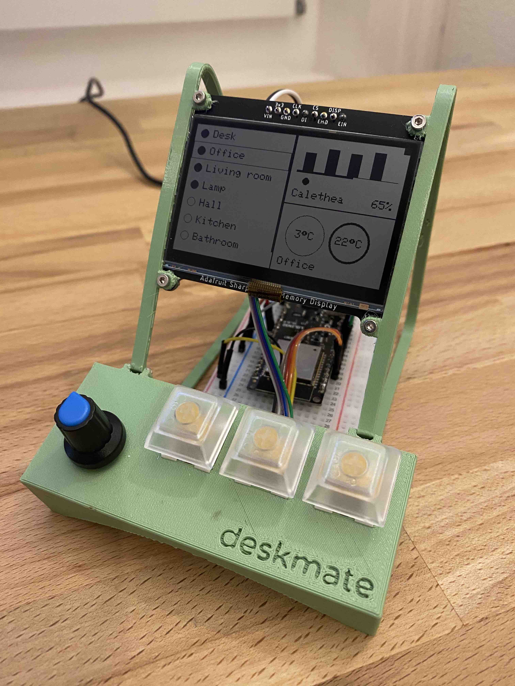
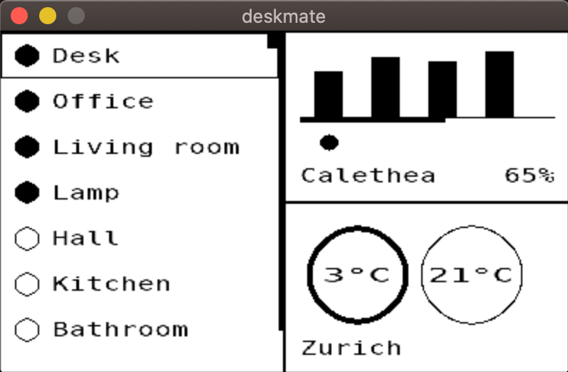

# deskmate
A hackable & portable [MQTT](https://mqtt.org/)-powered mini dashboard and control center.

  

For clarity, in this specific configuration, the display above shows:
* **Left panel** - The states of MQTT "smart" switches. Clicking turns them ON/OFF
* **Top right panel** - Soil moisture status of some of the plants around the house
* **Bottom right panel** - Current temperature in different rooms

## Hardware & portability
The main components in the photo above are:
* An [ESP32](https://docs.platformio.org/en/latest/boards/espressif32/lolin32.html) development board
* A 2.7" SHARP Memory Display by [Adafruit](https://www.adafruit.com/product/4694)
* A rotary encoder (similar to [this one from Adafruit](https://www.adafruit.com/product/377))
* Three mechanical switches from [Pimoroni](https://shop.pimoroni.com/products/kailh-mechanical-switches-pack-of-12?variant=32056315314259)

The core software should be fairly hardware-agnostic and the concrete implementations should be relatively portable to a bunch of other boards and displays.

As an example, this repo contains [a pure software implementation](code/sdl2) of the whole system. Here it is running on my macbook:

  

## Software
The software is organized into three directories:
* [`code/lib/`](code/lib) - Platform-agnostic core. Relies on abstract input/output systems
* [`code/arduino/`](code/arduino) - Arduino instantiation of the input/output systems & MQTT client
* [`code/sdl2/`](code/sdl2) - [SDL](https://www.sdl.com/)-based software-only instantiation of the input/output systems & MQTT client

## Case
The `.stl` files for the 3D printed frame can be found under `case/stl/`.
